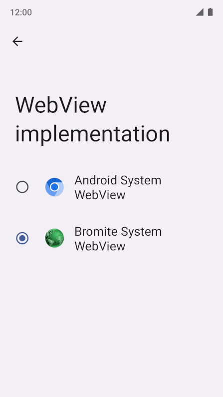

# Bromite SystemWebView Overlay

In order for Bromite SystemWebView to be [installed](https://github.com/bromite/bromite/wiki/Installing-SystemWebView), it must be one of the supported webviews hardcoded in the framework package. Since ROMs typically don't include Bromite SystemWebView among them, the community has developed some methods that allow the framework to be patched in order to include it.

This package makes use of a [resource overlay](https://source.android.com/docs/core/architecture/rros) to replace the list of hardcoded webviews with one that also includes the Bromite WebView. This method is more straightforward and elegant, as it does not require a rooted device nor the tedious process of installing Magisk modules or patching the system framework itself manually — if anything breaks the package can simply be removed. Moreover, the WebView itself does not need to be installed as a system app and has no potential risk of breaking SafetyNet — e.g. you can install it directly from F-Droid.

Some users have experienced issues with this installation process, so an overlay packaged as a [Magisk module](#magisk) is also provided. It is included for convenience only, and undergoes less frequent testing as the main developer does not endorse Magisk. The officially-endorsed and tested installation method still remains [installing via recovery](#installation).

Although this method should work on all Android versions that support Bromite and its WebView, **currently testing has only been done on LineageOS 19.1 for MicroG based on Android 12.1**.

## Prerequisites

* Treble-enabled ROM ([How to check?](https://github.com/phhusson/treble_experimentations/wiki/Frequently-Asked-Questions-%28FAQ%29#how-can-i-check-if-my-device-is-treble-enabled))
* Custom recovery **(preferred)**, support for rooted debugging (enabled via *Settings > Developer options > Rooted debugging*) or root access

## Installation

* Reboot device into recovery mode, either from the power menu, via a device-specific key combination or by typing the following command if the device has USB debugging enabled:  
`adb reboot recovery`
* Select *Apply update* then *Apply from ADB* and install the package using the following command:  
`adb sideload BromiteSystemWebViewOverlay.zip`
* If the installer complains about signature verification, install anyway by selecting **Yes**.
* Reboot the device.
* [Download the latest Bromite SystemWebView release](https://www.bromite.org/system_web_view) and install it as you would a regular app.
* Lastly, navigate to *Settings > Developer options > WebView implementation* and select the appropriate package or run the following command:  
`adb shell cmd webviewupdate set-webview-implementation org.bromite.webview`

If the above method doesn't work, try the [manual installation](#manual-installation) below.

### Work Profile

Be aware that if you have a work profile enabled you also need to install the package from the work profile a second time (usually via de Work Files app), otherwise work apps that rely on the WebView component will refuse to work or crash altogether.

To ensure that the package is installed for both profiles install the package via adb:  
`adb install <package-name>.apk`

### Manual installation

* Restart ADB with root privileges:  
`adb root`
* Mount the vendor folder as read-write:  
`adb shell mount -o rw,remount /vendor`
* Copy the required package to the overlay folder:  
`adb push treble-overlay-bromite-webview.apk /vendor/overlay`
* Verify if the correct permissions are set (optional):  
`adb shell stat /vendor/overlay/treble-overlay-bromite-webview.apk | grep "0644"`
* Mount the system as read-write:  
`adb shell mount -o rw,remount /`
* Copy the OTA survival script to the appropriate location:  
`adb push 99-bromite-webview.sh /system/addon.d`
* Make the script executable:  
`adb shell chmod 755 /system/addon.d/99-bromite-webview.sh`
* Verify if the correct permissions are set (optional):  
`adb shell stat /system/addon.d/99-bromite-webview.sh | grep "0755"`
* After all the files have been copied, reboot the device:  
`adb reboot`
* After rebooting you can verify if the overlay has been successfully installed (optional):  
`adb shell dumpsys webviewupdate`
* If everything is ok, you should see the following message:  
`org.bromite.webview is NOT installed.`

### Magisk

`BromiteSystemWebViewMagisk.zip` can be installed directly as a Magisk module. Simply copy it on your device, then install it via the normal Magisk UI.

Its main use case is for when you have Magisk already installed, where it works around an issue where some ROMs — in particular MicroG ROMs — do not have enough reserved partition space to install addons. This makes the previous installation options fail, sometimes in non-obvious ways. (Details in arovlad/bromite-webview-overlay#5 and lineageos4microg/docker-lineage-cicd#358)

It performs steps similar to the above, i.e. installs `treble-overlay-bromite-webview.apk` into `/vendor/overlay`, but as a Magisk module. The overlay is performed dynamically by Magisk at boot time, instead of directly modifying the vendor partition (until the next system update overwrites these changes). The OTA survival script is therefore not needed, as Magisk modules are not overwritten by system updates.

## Building

The following dependencies are required:

* `git`
* `xmlstarlet`
* `apktool`
* `zip`

To build the overlay and the flashable package, simply run the build script:
`./build.sh`

Alternatively, you can read a more in-depth guide [here](https://github.com/phhusson/treble_experimentations/wiki/How-to-create-an-overlay%3F).

## Credits

* [Pierre-Hugues Husson](https://github.com/phhusson) for the guide and toolkit
